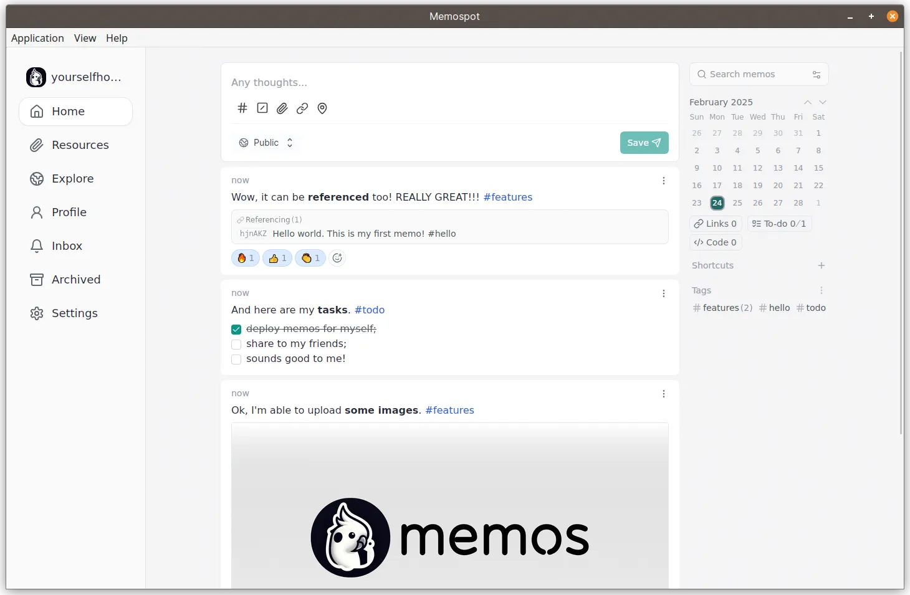

# Memospot

Self-contained desktop version of [Memos](https://github.com/usememos/memos) -a privacy-first, lightweight note-taking service. Available for Windows, macOS, and Linux.

This project allows you to use Memos locally without the Docker overhead or to easily test Memos before deploying a container. Data can be seamlessly moved between instances.

 

## Screenshots

<picture>
    <source media="(prefers-color-scheme: dark)" srcset="assets/capture_dark.webp" />
    <source media="(prefers-color-scheme: light)" srcset="assets/capture_light.webp" />
    
</picture>

## Key features

- Easy-to-use
- Full-featured [Memos experience](https://www.usememos.com/docs)
- Minimal overhead
- Data portability
- Enhanced privacy

## Requirements

- Windows 10, macOS, or Linux
- System WebView (Edge, Safari, or WebkitGTK).

> [!TIP]
> On Windows, you will be prompted to install WebView2, if it's not available.

## Installation

Download the latest release for your platform from the [GitHub Releases](https://github.com/memospot/memospot/releases) page.

> [!WARNING]
>
> - On Windows, you may get a warning from Windows Defender SmartScreen. This is because the app is not digitally signed. To solve, click `More info` and then `Run anyway`.
> - On macOS, you may need to [allow the app to run](https://support.apple.com/guide/mac-help/open-a-mac-app-from-an-unidentified-developer-mh40616/mac) first.

## Extra information

For advanced configuration, troubleshooting and standalone Memos server updates, see <https://memospot.github.io/>.

## Data Portability

> [!TIP]
> The current version of Memos stores assets in a portable format.
>
> Data can be seamlessly moved between Memos containers and Memospot instances, regardless of the operating system.

> [!IMPORTANT]
> If your data is coming from Memos v0.18.1 or earlier, see [Memospot data migration](https://memospot.github.io/data-migration#migrating-data-from-earlier-memos-versions).

## Special Thanks

This project is made possible by the following open-source projects:

  <a href="https://www.usememos.com/">
    <picture>
      <source
        media="(prefers-color-scheme: dark)"
        srcset="assets/powered_by_memos_dark.webp"
      />
      <source
        media="(prefers-color-scheme: light)"
        srcset="assets/powered_by_memos.webp"
      />
      
    </picture>
  </a>

  

     

  

  <a href="https://tauri.app/">
    <picture>
      <source
        media="(prefers-color-scheme: dark)"
        srcset="assets/made_with_tauri_dark.webp"
      />
      <source
        media="(prefers-color-scheme: light)"
        srcset="assets/made_with_tauri.webp"
      />
      
    </picture>
  </a>

## Star History

<picture>
  <source media="(prefers-color-scheme: dark)" srcset="https://api.star-history.com/svg?repos=memospot/memospot,memospot/memos-builds&type=Date&theme=dark" />
  <source media="(prefers-color-scheme: light)" srcset="https://api.star-history.com/svg?repos=memospot/memospot,memospot/memos-builds&type=Date" />
  
</picture>

## Supporting

If you appreciate this project, be sure to [⭐star](https://github.com/memospot/memospot) it on GitHub.
